# Pembelajaran 1: Statistika Deskriptif (Descriptive Statistics )

## Pengenalan Tipe Data

### Tipe Kuantitatif  dan Katagorikal

**Kuantitatif**  tipe ini berisi  data  numerik  yang dapat diolah  menggunakan operasi matematika ( seperti jumlah  anak anjing).

**[Continuous vs. Discrete](https://www.youtube.com/watch?v=BzgZebZD9kk&feature=emb_logo)** :tv:

 
Kuantitatif dibagi lagi kedalam dua  jenis yaitu  kontinu (continuous) dan diskrit (discrete)

**Data Continuous dapat dipecah  kedalam satuan  yang lebih kecil**. Contohnya  umur dari seekor anjing atau kucing yang dapat  dihitung kedalam bentuk umur tahunan, bulanan, ataupun harian, dan selalu berubah dari hari kehari nilainya

**Data Discrete  merupakan tipe data  yang berisi nilai yang hanya dapat dihitung**. Misalnya  jumlah anak anjing yang ada di petshop .

----

**Categorical** 
Tipe data ini biasanya berisi label dalam suatu item group( misalnya  jenis anak anjing  -  ada jenis Collies, Labs, Poodles, dan masih banyak lagi .).

**[Categorical Ordinal vs. Categorical Nominal](https://www.youtube.com/watch?v=k5bLaPGY2Vw&feature=emb_logo)** :tv:

Data categorical  dibagi kedalam dua tipe  juga yaitu  Ordinal dan  Nominal.
 

**Categorical Ordinal** tipe data ini biasanya  berbentuk **urutan  rangking** (seperti skala interaksi manusia dengan anjing dan di rangking dari skala buruk hingga bagus).

**Categorical Nominal** data **tidak ada urutan rangking** (contohnya jenis anjing).

----

### Recap

|   DATA TYPES  |                             |                                                       |
|:-------------:|:---------------------------:|:-----------------------------------------------------:|
| Quantitative: | Continuous                  | Discrete                                              |
|               | Tinggi, umur, pendapatan         | jumlah halaman dalam buku, ukuran pohon dalam yard, anjing di taman perumahan|
|               |                             |                                                       |
| Categorical:  | Ordinal                     | Nominal                                               |
|               | rangking kualitas surat, Survey Rating | Gender,   Status Perkawinan, Breakfast                |

**Quantitative vs. Categorical**

Namun Beberapa di antaranya bisa sedikit rumit - contohnya dalam nilai kode pos   , meskipun kode pos adalah angka, namun sebenarnya bukan variabel kuantitatif. Jika kita melakukan operas matematika misalnya menambahkan  dua kode pos bersama-sama, kita tidak mendapatkan informasi yang berguna dari nilai baru ini. Oleh karena itu, ini adalah variabel kategoris.

***Tinggi, umur, jumlah halaman dalam buku dan pendapa, nilai ini  dapat dilakukan operasi matematika  dan hasilnya bisa berupa insight yang berguna sehingga termasuk kedalam  tipe*** **quantitative**.

***Gender, Letter Grade, Breakfast Type, Marital Status, and Zip Code dapat dianggap sebagai label untuk sekelompok item atau individu. Oleh karena itu, ini adalah tipe*** **categorical**.

**Continuous vs. Discrete**

Untuk mempertimbangkan apakah kita memiliki data kontinu atau diskrit, kita harus melihat apakah kita dapat membagi data kita menjadi unit yang lebih kecil dan lebih kecil. Pertimbangkan waktu - kita dapat mengukur suatu peristiwa dalam tahun, bulan, hari, jam, menit, atau detik, dan bahkan pada detik kita tahu ada unit yang lebih kecil yang dapat kita ukur waktu. Oleh karena itu, kita tahu tipe data ini termasuk kedalam tipe data kontinu. Tinggi badan, usia, dan pendapatan adalah contoh data continu. Atau, jumlah halaman dalam sebuah buku, anjing yang saya hitung di taman perumahan, atau pohon di halaman adalah data diskrit.

Tipe data kontinu adalah tipe data yang dapat mengambil nilai desimal, sedangkan tipe data diskrit adalah tipe data yang dapat dihitung.

**Ordinal vs. Nominal**

Dalam melihat variabel kategori, kami menemukan Gender, Status Perkawinan, Kode Pos dan item Sarapan Anda adalah variabel nominal dimana tidak ada peringkat urutan yang terkait dengan jenis data ini. Apakah Anda makan sereal, roti panggang, telur, atau hanya kopi untuk sarapan; tidak ada urutan peringkat yang terkait dengan sarapan Anda.

Atau, Peringkat Surat atau Peringkat Survei memiliki urutan peringkat yang terkait dengannya, sebagai data ordinal. Jika Anda menerima A, ini lebih tinggi dari A-. A- berperingkat lebih tinggi dari B+, dan seterusnya. Variabel ordinal sering muncul pada skala penilaian dari sangat buruk hingga sangat baik. Dalam banyak kasus, ketika proses analisis  biasanya akan dilakukan pengubahan variabel ordinal ini menjadi angka, karena  dengan cara ini  dapat menganalisisnya dengan lebih mudah.

**Final Words**

> Di pembelajaran ini, kita  dapat melihat berbagai tipe data yang mungkin kita gunakan di dunia sekitar kita. Saat kita  bekerja dengan data, mungkin kondisi data  tidak terlalu bersih - terkadang ada kesalahan ketik atau nilai yang hilang. Dalam hal ini, hanya memiliki beberapa keahlian mengenai data dan mengetahui tipe data dapat membantu kemampuan kita untuk 'membersihkan' data ini. Memahami tipe data juga dapat membantu kemampuan kita membangun visual untuk menjelaskan data dengan baik.

## Pengantar Statistik Ringkasan

### Menganalisis Data Kuantitatif

Empat Aspek Data Kuantitatif

Ada empat aspek utama untuk menganalisis data Kuantitatif:

1. [Measures of Center](#measures-of-center)
2. [Measures of Spread](#measures-of-spread)
3. The Shape of the data.
4. Outliers

**Menganalisa Data Categorical **

Data kategoris biasanya dianalisis dengan melihat jumlah atau proporsi individu yang masuk ke dalam masing-masing kelompok. Misalnya jika kita melihat ras anjing, kita akan peduli tentang berapa banyak anjing dari setiap ras, atau berapa proporsi anjing dari setiap jenis ras.

## Measures of Center
Ada tiga pengukuran terpusat (measures of center ):

1. [The Mean](https://www.youtube.com/watch?v=1nzZxmJ8xvU&feature=emb_logo) :tv:
Dalam video ini, kita akan  fokus pada perhitungan mean. Rata-rata ***sering disebut average*** atau nilai yang diharapkan dalam matematika. Untuk menghitung rata- dilakukan  dengan menambahkan semua nilai keseluruhan, dan membaginya dengan jumlah nilai dalam kumpulan data.

1. [The Median](https://www.youtube.com/watch?v=WlT3eeW0rb0&feature=emb_logo) :tv:
Median membagi data kita sehingga 50% dari nilai kita lebih rendah dan 50% lebih tinggi. Berdasarkan video  ini bahwa cara untuk menghitung median  yaitu bergantung pada   jumlah pengamatan genap ataupun jumlah pengamatan ganjil.
**Median untuk Nilai Ganjil**

Jika kita memiliki jumlah pengamatan ganjil,  nilai median  yaitu  angka yang di tengah. Misalnya, jika  memiliki 7 pengamatan, median adalah nilai ke 4 ketika nomor kita diurutkan dari terkecil ke terbesar. Jika kita memiliki 9 pengamatan, median adalah nilai ke 5.

**Median untuk Nilai Genap**

Jika kita memiliki jumlah pengamatan genap, median adalah rata-rata dari dua nilai di tengah. Misalnya, jika kita memiliki 8 pengamatan, kita rata-rata nilai ke 4  dan ke 5  bersama-sama ketika nomor kita diurutkan dari terkecil ke terbesar.

Untuk menghitung median kita **HARUS mengurutkan nilai kita terlebih dahulu**.

Apakah kita menggunakan mean atau median untuk menggambarkan dataset sebagian besar tergantung pada bentuk dataset kita

1. [The Mode](https://www.youtube.com/watch?v=NE81NZgECqg&feature=emb_logo)  :tv:
Modus adalah nilai yang paling sering diamati dalam dataset.

Mungkin ada beberapa mode untuk kumpulan data tertentu, atau tidak ada mode sama sekali.

**Tanpa Modus**

Jika semua pengamatan dalam kumpulan data kami diamati dengan frekuensi yang sama, tidak ada mode. Jika kita memiliki kumpulan data:

1, 1, 2, 2, 3, 3, 4, 4

1 = 2
2 = 2
3 = 2
4 = 2

Tidak ada modus, karena dari angka 1-4 memiliki jumlah angka yang sama   .

**Banyak Mode**

 

1, 2, 3, 3, 3, 4, 5, 6, 6, 6, 7, 8, 9
1 = 1
2 = 1
**3 = 3**
4 = 4
5 = 1
**6 = 3**
7 = 1
8 = 1
9 = 1

Ada dua mode 3 dan 6, karena nilai-nilai ini memiliki frekuensi maksimum sebanyak 3 kali, sementara semua nilai lainnya hanya muncul sekali.
### [What is Notation?](https://www.youtube.com/watch?v=MaHV5cKfcmE) :tv:

**Notasi**

> Notasi adalah bahasa yang umum digunakan untuk mengkomunikasikan ide-ide matematika. Pikirkan notasi sebagai bahasa universal yang digunakan oleh para profesional akademik dan industri untuk menyampaikan ide-ide matematika.

Kita  mungkin sudah mengetahui beberapa notasi. Plus, minus, perkalian, pembagian, dan tanda sama dengan semuanya memiliki simbol matematika yang mungkin sudah kita kenal. Masing-masing simbol ini menggantikan ide tentang bagaimana angka berinteraksi satu sama lain. Dalam konsep yang akan datang,  kita akan diperkenalkan dengan beberapa pengetahuan tambahan terkait dengan notasi.  

 

### [Random Variales](https://www.youtube.com/watch?v=8NxTW1u4s-Y) :tv:

**Contoh Memperkenalkan Notasi**

> Ada banyak hal yang terjadi dalam video ini - berikut adalah rekap dari ide-ide besarnya.

**Rows and Columns**

Jika   tidak terbiasa dengan spreadsheet, ini akan dibahas secara rinci dalam pelajaran mendatang. Spreadsheet adalah cara umum untuk menyimpan data dan terdiri dari baris dan kolom. Baris   tersusun secara horizontal, sedangkan kolom tersusun secara vertikal. Setiap kolom dalam spreadsheet biasanya menyimpan variabel tertentu, sedangkan setiap baris biasanya disebut instance atau individu.

Contoh yang ada  dalam video ditunjukkan di bawah ini.

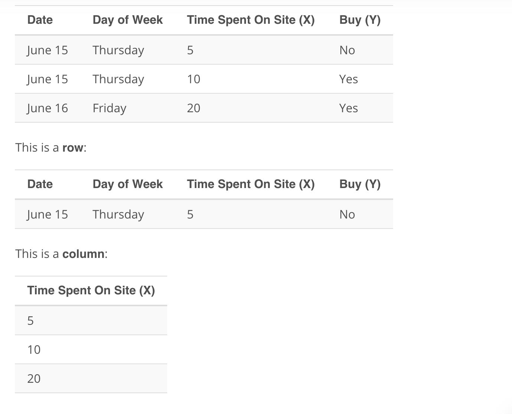

**Sebelum Mengumpulkan Data**

Sebelum mengumpulkan data, kita biasanya memulai dengan sebuah pertanyaan, atau banyak pertanyaan, yang ingin kita jawab. Tujuan data adalah untuk membantu kita dalam menjawab pertanyaan-pertanyaan ini.

**Random Variables**

Random Variables adalah pengganti untuk nilai yang mungkin dari beberapa proses (kebanyakan ... istilah 'beberapa proses' agak ambigu). Seperti yang dinyatakan sebelumnya, notasi berguna karena membantu kita mengambil ide-ide kompleks dan menyederhanakan (seringkali menjadi satu huruf atau simbol tunggal). kita bisa  melihat  bahwa Random Variables diwakili oleh **huruf besar (X, Y, atau Z adalah cara umum untuk mewakili Random Variables)**.

kita mungkin memiliki variabel acak X, yang merupakan pemegang nilai yang mungkin dari jumlah waktu yang dihabiskan seseorang di situs kita. Atau variabel acak Y, yang merupakan pemegang nilai yang mungkin dari apakah seseorang membeli suatu produk atau tidak.

X adalah 'pemegang' nilai yang mungkin terjadi untuk jumlah waktu yang dihabiskan di situs web kami. Setiap nomor dari 0 sampai tak terhingga benar-benar.

### [Capital vs. Lower](https://www.youtube.com/watch?v=KFIt2OC3wCI) :tv:

**Capital vs. Lower Case Letters**

**Random variables are represented by capital letters. Once we observe an outcome of these random variables, we notate it as a lower case of the same letter**.

**Example 1**

For example, the amount of time someone spends on our site is a random variable (we are not sure what the outcome will be for any particular visitor), and we would notate this with X. Then when the first person visits the website, if they spend 5 minutes, we have now observed this outcome of our random variable. We would notate any outcome as a lowercase letter with a subscript associated with the order that we observed the outcome.

If 5 individuals visit our website, the first spends 10 minutes, the second spends 20 minutes, the third spends 45 mins, the fourth spends 12 minutes, and the fifth spends 8 minutes; we can notate this problem in the following way:

X is the amount of time an individual spends on the website.

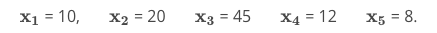

The capital **X** is associated with this idea of a random variable, while the observations of the random variable take on lowercase **x** values.

**Example 2**

Taking this one step further, we could ask:

What is the probability someone spends more than 20 minutes in our website?

In notation, we would write:

**P(X > 20)?**

Here P stands for probability, while the parentheses encompass the statement for which we would like to find the probability. Since X represents the amount of time spent on the website, this notation represents the probability the amount of time on the website is greater than 20.

We could find this in the above example by noticing that only one of the 5 observations exceeds 20. So, we would say there is a 1 (the 45) in 5 or 20% chance that an individual spends more than 20 minutes on our website (based on this dataset).

**Example 3**

If we asked: What is the probability of an individual spending 20 or more minutes on our website? We could notate this as:

**P(X \geq≥ 20)?**

We could then find this by noticing there are two out of the five individuals that spent 20 or more minutes on the website. So this probability is 2 out of 5 or 40%.

**Notation for Calculating the Mean**

We know that the mean is calculated as the sum of all our values divided by the number of values in our dataset.

In our current notation, adding all of our values together can be extremely tedious. If we want to add 3 values of some random variable together, we would use the notation:

​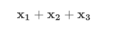	 

If we want to add 6 values together, we would use the notation:

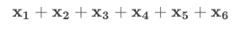
​

To extend this to add one hundred, one thousand, or one million values would be ridiculous! How can we make this easier to communicate?!

### Aggregations

**An aggregation is a way to turn multiple numbers into fewer numbers (commonly one number)**.

[Summation](https://www.youtube.com/watch?v=ADx1x2ljFB4) :tv: is a common aggregation. The notation used to sum our values is a greek symbol called sigma Σ.

**Example 1**

Imagine we are looking at the amount of time individuals spend on our website. We collect data from nine individuals:

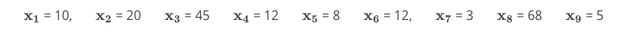

If we want to sum the first three values together in our previous notation, we write:

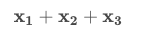

In our new notation, we can write:

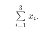
Notice, our notation starts at the first observation (i=1i=1) and ends at 3 (the number at the top of our summation).

So all of the following are equal to one another:

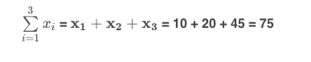

**Example 2**

Now, imagine we want to sum the last three values together.

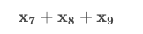
​	 
In our new notation, we can write:

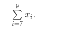

Notice, our notation starts at the seventh observation (i=7i=7) and ends at 9 (the number at the top of our summation).

**Other Aggregations**

The **Σ** is used for aggregating using **summation**, but we might choose to aggregate in other ways. Summing is one of the most common ways to need to aggregate. However, we might need to aggregate in alternative ways. If we wanted to multiply all of our values together we would use a **Π** , capital Greek letter pi. The way we **aggregate continuous values** is with something known as **integration (a common technique in calculus), which uses the following symbol ∫** which is just a long s. We will not be using integrals or products for quizzes in this class, but you may see them in the future!

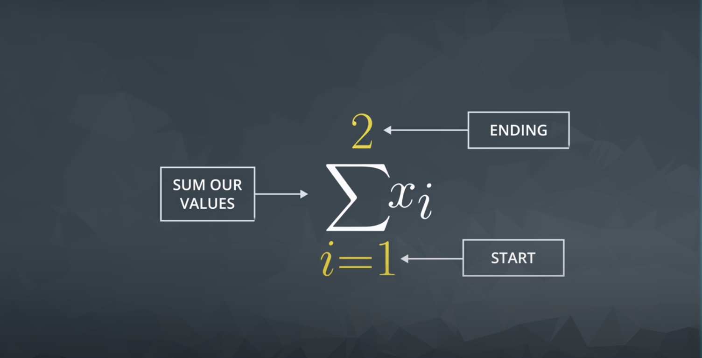

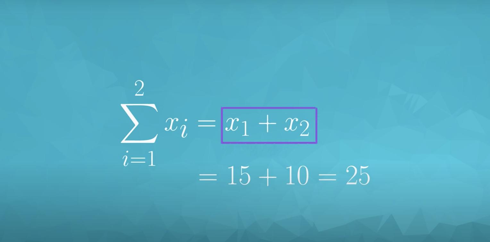

## [Notation for the Mean](https://www.youtube.com/watch?v=3EF15AoRxyM) :tv:
Pay attention to 1:15

**Final Steps for Calculating the Mean**

To finalize our calculation of the mean, we introduce n as the total number of values in our dataset. We can use this notation both at the top of our summation, as well as for the value that we divide by when calculating the mean.

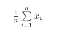

​
Instead of writing out all of the above, we commonly write x bar
  to represent the mean of a dataset. Although, similar to the first video, we could use any variable. Therefore, we might also write y bar, or any other letter.

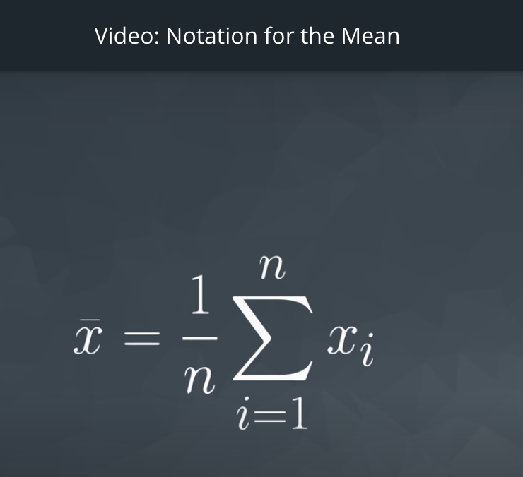  

We also could index using any other letter, not just ii. We could just as easily use jj, kk, or mm to index each of our data values. The quizzes on the next concept will help reinforce this idea.

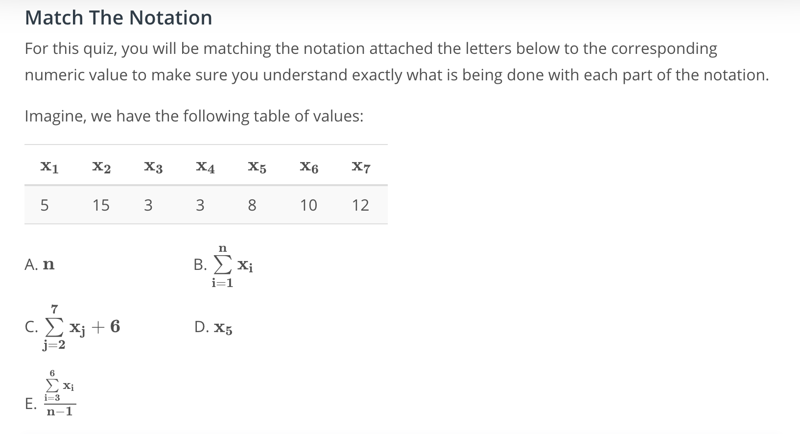

## Notation Recap

**Notation**

Notation is an essential tool for communicating mathematical ideas. We have introduced the fundamentals of notation in this lesson that will allow you to read, write, and communicate with others using your new skills!

**Notation and Random Variables**

As a quick recap, capital letters signify random variables. When we look at individual instances of a particular random variable, we identify these as lowercase letters with subscripts attach themselves to each specific observation.

For example, we might have X be the amount of time an individual spends on our website. Our first visitor arrives and spends 10 minutes on our website, and we would say \bold{x_1}x
1
​	  is 10 minutes.

We might imagine the random variables as columns in our dataset, while a particular value would be notated with the lower case letters.

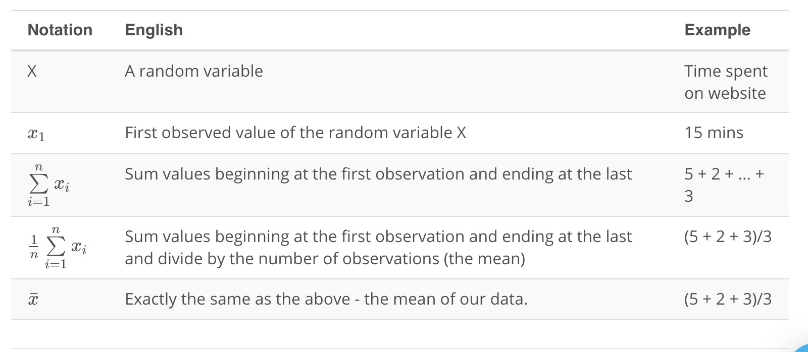

**Notation for the Mean**

We took our notation even farther by introducing the notation for summation ∑. Using this we were able to calculate the mean as:

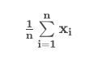

In the next section, you will see this notation used to assist in your understanding of calculating various measures of spread. Notation can take time to fully grasp. Understanding notation not only helps in conveying mathematical ideas, but also in writing computer programs - if you decide you want to learn that too! Soon you will analyze data using spreadsheets. When that happens, many of these operations will be hidden by the functions you will be using. But until we get to spreadsheets, it is important to understand how mathematical ideas are commonly communicated. This isn't easy, but you can do it!

----

# Lesson 2: Descriptive Statistics II

## [What are Measures of Spread](https://www.youtube.com/watch?v=zb76Z_viYLY) :tv:

## Measures of Spread

Measures of Spread are used to provide us an idea of how spread out our data are from one another. Common measures of spread include:

1. [Range](#range)
2. [Interquartile Range (IQR)](#iqr)
3. [Standard Deviation](#standard-deviation)
4. [Variance](#variance)

Throughout this lesson you will learn how to calculate these, as well as why we would use one measure of spread over another.

### [Histograms](https://www.youtube.com/watch?v=4t10RgUv2Fc) :tv:

**Histograms**

Histograms are super useful to understanding the different aspects of quantitative data. In the upcoming concepts, you will see histograms used all the time to help you understand the four aspects we outlined earlier regarding a quantitative variable:

- center
- spread
- shape
- outliers

## [Introduction to Five Number Summary](https://www.youtube.com/watch?v=gzUN5zKLHjQ)  :tv:

Calculating the 5 Number Summary

**The five number summary consist of 5 values:**

1. Minimum: The smallest number in the dataset.
2. **Q1**: The value such that 25% of the data fall below.
3. **Q2**: The value such that 50% of the data fall below.
4. **Q3**: The value such that 75% of the data fall below.
5. Maximum: The largest value in the dataset.

In the above video we saw that calculating each of these values was essentially just finding the median of a bunch of different dataset. Because we are essentially calculating a bunch of medians, the calculation depends on whether we have an odd or even number of values.

### Range

The range is then calculated as the difference between the maximum and the minimum.

### IQR

The interquartile range is calculated as the difference between **Q3** and **Q1**.

In the upcoming sections, you will practice this with Katie and on your own.

## [Introduction to Standard Deviation and Variance](https://www.youtube.com/watch?v=IbwUJ3ORZ5s) :tv:

**Standard Deviation and Variance**

### Standard Deviation

The **standard deviation** is one of the most common measures for talking about the spread of data. It is defined as the **average distance of each observation from the mean**.

In the above video we saw this as how far individuals were from the average distance from work (the example distances shown are examples from the full data set, the mean of just those 4 numbers is 38.5. The mean of 18 shown later in the video is the mean of the full data set which is not shown in the video). In the next video, you will see exactly how this is calculated.

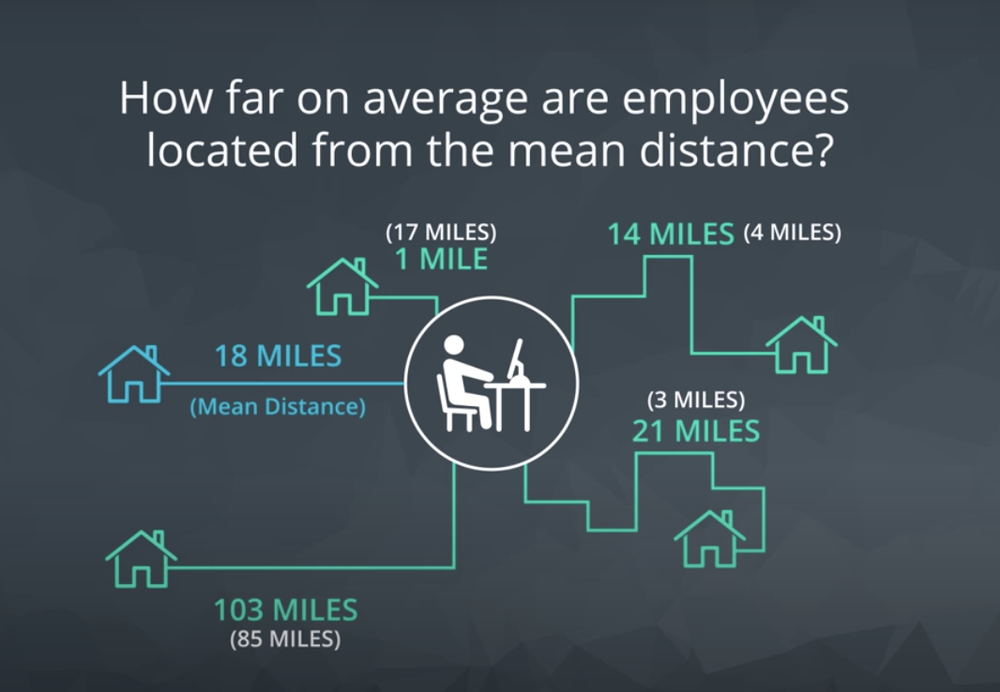

## [Standard Deviation Calculation](https://www.youtube.com/watch?v=H5zA1A-XPoY) :tv:

1. Find the Mean

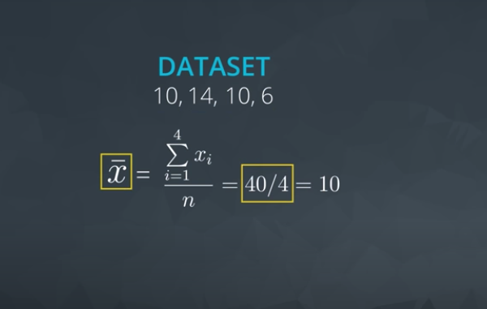

2. Look at the distance from each observation from the mean

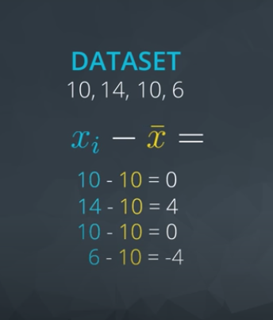

3. Then Average it

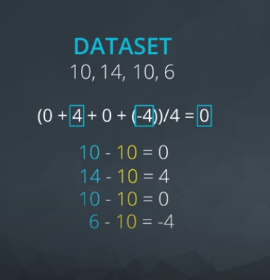

**But zero is not a good measure of spread!**

***So we need to make all the values positive, the way we do this when calculating standard deviation is by squaring it***

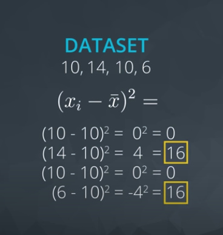

***Average this to find the averaged squared distance from the mean***

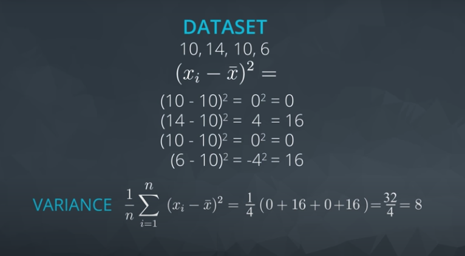

### Variance

This is called the **Variance** -- The average squared difference of each observation form the mean. **However, this is the averaged of squared values**, which we only did to get positive values in the first place.

The units of the variance are the square of the original units of your data.

**To get the Standard Deviation:**
Get the square root of the ending value:

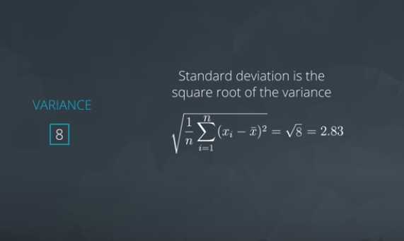

This is called the **Standard Deviation** -- on average, how far each point in our dataset is from the mean.

## Other Measures of Spread

### 5 Number Summary

In the previous sections, we have seen how to calculate the values associated with the five number summary (min, Q1, Q2, Q3, max), as well as the measures of spread associated with these values (range and IQR).

For datasets that are **not symmetric**, the five number summary and a corresponding box plot are a great way to get started with understanding the spread of your data. **Although I still prefer a histogram in most cases, box plots can be easier to compare two or more groups**. You will see this in the quizzes towards the end of this lesson.

**Variance and Standard Deviation**

Two additional **measures of spread** that are used all the time are the variance and standard deviation. At first glance, the variance and standard deviation can seem overwhelming. If you do not understand the expressions below, don't panic! In this section, I just want to give you an overview of what the next sections will cover. We will walk through each of these parts thoroughly in the next few sections, but the big picture goal is to generally understand the following:

1. How the mean, variance and standard deviation are calculated.
2. Why the measures of variance and standard deviation make sense to capture the spread of our data.
3. Fields where you might see these values used.
4. Why we might use the standard deviation or variance as opposed to the values associated with the 5 number summary for a particular dataset.

**Calculation**

We **calculate the variance** in the following way:
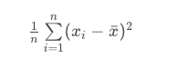

The variance is the **average squared difference of each observation from the mean**.

To calculate the variance of a set of 10 values in a spreadsheet application, with our 10 data points in column A, we would create a new column B by typing in something like **=A1-AVERAGE(A$1:A$10)** and copying this down for all 10 rows. This would find us the difference between each data point and the mean average of all the data. Then we create a new column C having the square of these differences, using the formula **=B1^2** in cell C1, and copying that down for all rows. Then in the cell below this new column, cell C11, type in **=SUM(C1:C10)**. This adds up all these values in column C. Finally in cell C12, we divide this sum by the number of data points we have, in this case ten: **=C11/10**. This cell C12 now contains the variance for our 10 data points.

### [Calculating Standard Deviation and Variance](Misc/Standard-Deviation-and-Variance.xlsx)

More detailed guidance on using spreadsheets like this may be included in a future lesson in your program.

The **standard deviation is the square root of the variance**. Therefore, the formula for the standard deviation is the following:

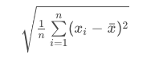

In the same spreadsheet as above, to find the standard deviation of our same set of 10 data values, we would use another cell like C13 to take the square root of our variance measure, by typing in **=sqrt(C12)**.

The standard deviation is a measurement that has the same units as our original data, while the units of the variance are the square of the units in our original data. For example, if the units in our original data were dollars, then units of the standard deviation would also be dollars, while the units of the variance would be dollars squared.

Again, this section is designed as background knowledge for the following sections. If it doesn't make sense on this first pass, do not worry. You will be guided in future sections in performing these calculations, and building your intuition, as you work through an example using the salary data. Then we will provide context about why these calculations are important, and where you might see them!

### [Why the Standard Deviation?](https://www.youtube.com/watch?v=XlTBvjQ2t8w) :tv:

### [Important Final Points](https://www.youtube.com/watch?v=vXUgp2375j4) :tv:

**Important Final Points**

1. The variance is used to compare the spread of two different groups. A set of data with higher variance is more spread out than a dataset with lower variance. Be careful though, there might just be an outlier (or outliers) that is increasing the variance, when most of the data are actually very close.

2. When comparing the spread between two datasets, the units of each must be the same.

3. When data are related to money or the economy, higher variance (or standard deviation) is associated with higher risk.

4. The standard deviation is used more often in practice than the variance, because it shares the units of the original dataset.

**Use in the World**

> The standard deviation is associated with risk in finance, assists in determining the significance of drugs in medical studies, and measures the error of our results for predicting anything from the amount of rainfall we can expect tomorrow to your predicted commute time tomorrow.

These applications are beyond the scope of this lesson as they pertain to specific fields, but know that understanding the spread of a particular set of data is extremely important to many areas. In this lesson you mastered the calculation of the most common measures of spread.

**Little tidbits from the quizzes**

* Additionally, the range isn't directly associated with the standard deviation, so we can't make a claim that is always true like the final option.

* Since the standard deviation is a measure of spread, a zero value suggests that all of our data points are the same value.

* Besides the mean return of an investment, we should also consider the spread associated with the return. But just because the standard deviation associated with each investment is the same, this does not mean the max you could make for each investment is the same.

**Real World Example from Quizzes**

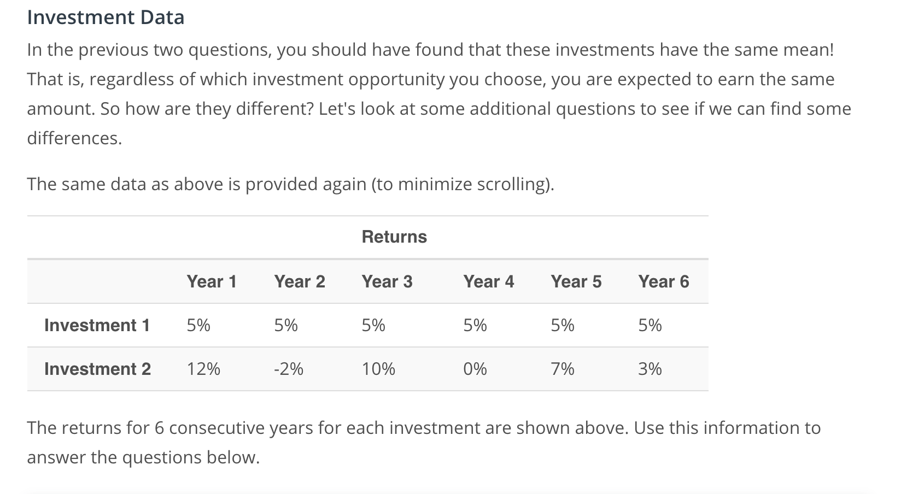

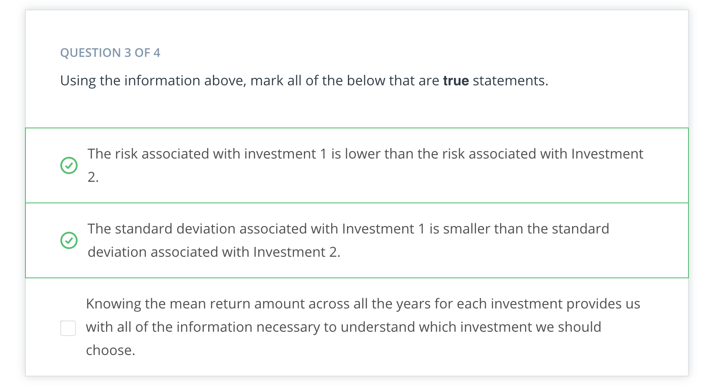

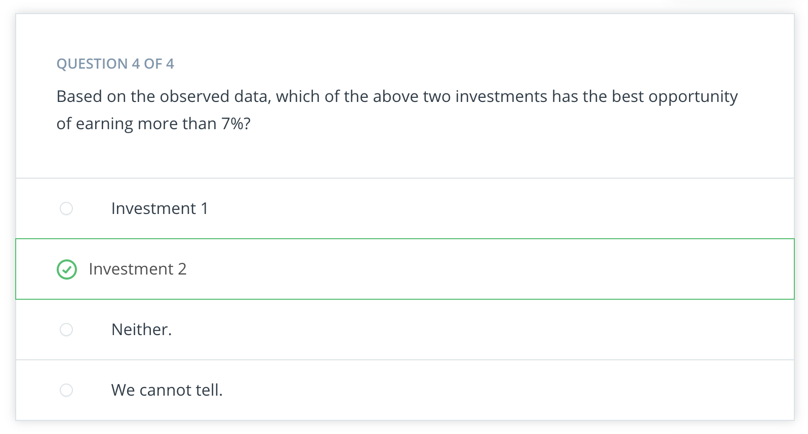

**Useful insight**

> The above example is a simplified version of the real world, but does point out something useful that you may have heard before. Notice if you were not fully invested in either Investment 1 or fully invested in Investment 2, but instead you were diversified across both investment options, you could earn more than either investment individually. This is the benefit of diversifying your portfolio for long term gains. For short term gains, you might not need or want to diversify. You could get lucky and hit short term gains associated with the upswings (12%, 10%, or 7%) of Investment 2. However, you might also get unlucky, and hit a down term and earn nothing or even lose money on your investment using this same strategy.

## Measures of Center and Spread Summary

**Variable Types**

We have covered a lot up to this point! We started with identifying data types as either **categorical** or **quantitative**. We then learned, we could identify **quantitative** variables as either **continuous** or **discrete**. We also found we could identify **categorical** variables as either **ordinal** or **nominal**.

**Categorical Variables**

When analyzing categorical variables, we commonly just look at the count or percent of a group that falls into each level of a category. For example, if we had two levels of a dog category: lab and not lab. We might say, 32% of the dogs were lab (percent), or we might say 32 of the 100 dogs I saw were labs (count).

However, the 4 aspects associated with describing quantitative variables are not used to describe categorical variables.

**Quantitative Variables**

Then we learned there are four main aspects used to describe quantitative variables:

1. Measures of Center
2. Measures of Spread
3. Shape of the Distribution
4. Outliers

We looked at calculating **measures of Center**

1. Means
2. Medians
3. Modes

We also looked at calculating **measures of Spread**

1. Range
2. Interquartile Range
3. Standard Deviation
4. Variance

**Calculating Variance**

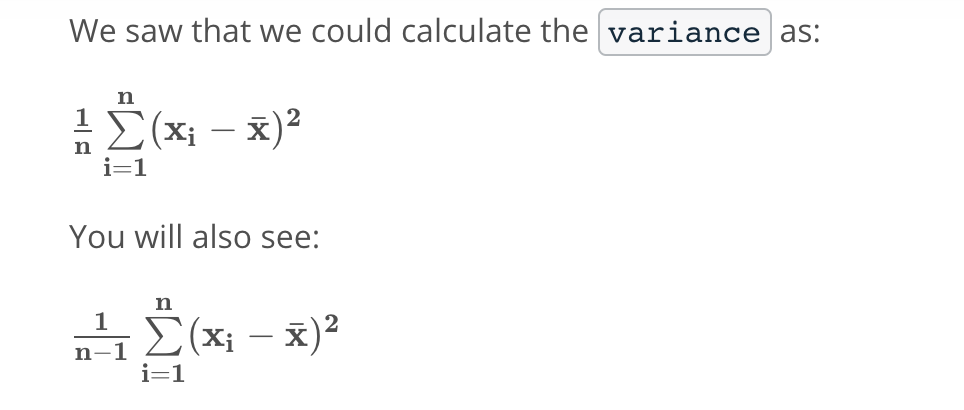

The reason for this is beyond the scope of what we have covered thus far, but you can find an explanation [here](https://stats.stackexchange.com/questions/3931/intuitive-explanation-for-dividing-by-n-1-when-calculating-standard-deviation).

You can commonly find answers to your questions with a quick Google search. Now is a great time to get started with this practice! This answer should make more sense at the completion of this lesson.

**Standard Deviation vs. Variance**

The standard deviation is the square root of the variance. In practice, you usually use the standard deviation rather than the variance. The reason for this is because the standard deviation shares the same units with our original data, while the variance has squared units.

### What Next?

In the next sections, we will be looking at the last two aspects of quantitative variables: **shape** and **outliers**. What we know about measures of center and measures of spread will assist in your understanding of these final two aspects.

### [Shape](https://www.youtube.com/watch?v=UnN99AAYf8k)  :tv:

**Histograms**

We learned how to build a histogram in this video, as this is the most popular visual for quantitative data.

**Shape**

From a histogram we can quickly identify the shape of our data, which helps influence all of the measures we learned in the previous concepts. We learned that the distribution of our data is frequently associated with one of the three shapes:

1. Right-skewed

2. Left-skewed

3. Symmetric (frequently normally distributed)

**The skew is the direction of the longer whisker.**

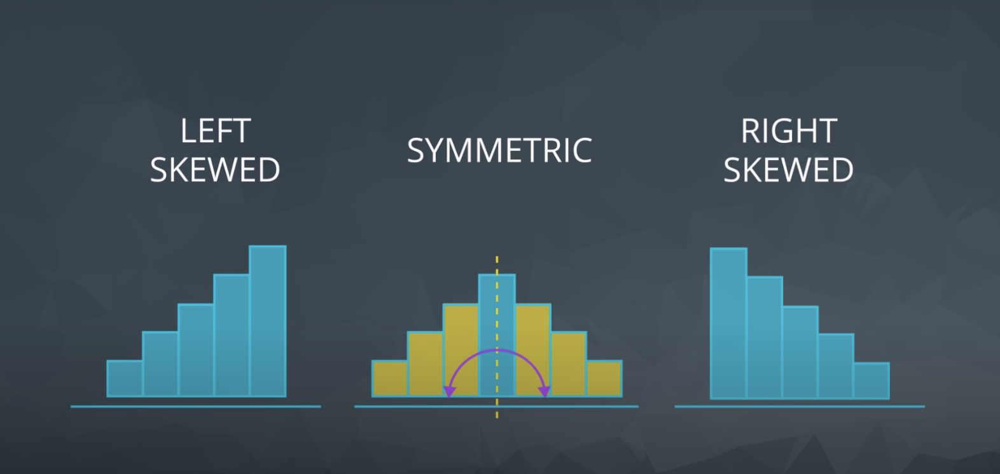

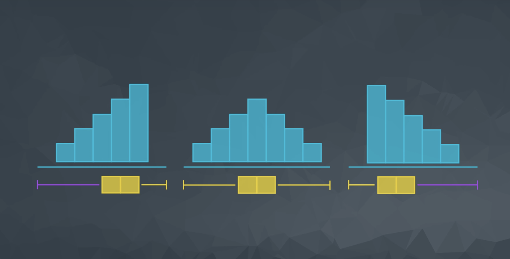

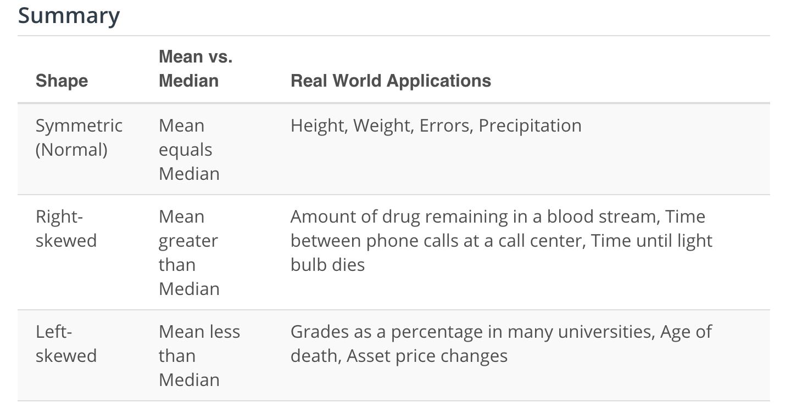

The mode of a distribution is essentially the tallest bar in a histogram. There may be multiple modes depending on the number of peaks in our histogram.

### [The Shape of Data in Real World](https://www.youtube.com/watch?v=HmipezTjTDY)  :tv:

References
These are the references used to pull the applications of each shape.

* [Quora](https://www.quora.com/What-are-some-real-world-examples-of-normally-distributed-quantities)
* [University of Texas](https://www.utdallas.edu/~scniu/OPRE-6301/documents/Important_Probability_Distributions.pdf)
* [Stack Exchange](https://stats.stackexchange.com/questions/89179/real-life-examples-of-distributions-with-negative-skewness)

**Little tidbits from the quizzes**

* Remember right-skewed distributions have a tail towards larger values. How, do you think a few large values influences the mean?

* Remember left-skewed distributions have a tail towards smaller values. How, do you think a few small values influences the mean?

* The mean is pulled by the tail of the distribution.

## [Outliers](https://www.youtube.com/watch?v=HKIsvkZUZfo) :tv:

**Outliers**
We learned that **outliers** are points that fall very far from the rest of our data points. This influences measures like the mean and standard deviation much more than measures associated with the five number summary.

**Identifying Outliers**
There are a number of different techniques for identifying outliers. A full paper on this topic is provided [here](http://d-scholarship.pitt.edu/7948/1/Seo.pdf). In general, I usually just look at a picture and see if something looks suspicious!

### [Working with Outliers](https://www.youtube.com/watch?v=4RnQjtJB8t8) :tv:

**Common Techniques**
When outliers are present we should consider the following points.

1. Noting they exist and the impact on summary statistics.

2. If typo - remove or fix

3. Understanding why they exist, and the impact on questions we are trying to answer about our data.

4. Reporting the 5 number summary values is often a better indication than measures like the mean and standard deviation when we have outliers.

5. Be careful in reporting. Know how to ask the right questions.

### [Outliers Advice](https://www.youtube.com/watch?v=BhhDoTgYQmI) :tv:

Below are my guidelines for working with any column (random variable) in your dataset.

1. Plot your data to identify if you have outliers.

2. Handle outliers accordingly via the methods above.

3. If no outliers and your data follow a normal distribution - use the mean and standard deviation to describe your dataset, and report that the data are normally distributed.

**Side note**

If you aren't sure if your data are normally distributed, there are plots called [normal quantile plots](http://data.library.virginia.edu/understanding-q-q-plots/) and statistical methods like the [Kolmogorov-Smirnov test](https://en.wikipedia.org/wiki/Kolmogorov%E2%80%93Smirnov_test) that are aimed to help you understand whether or not your data are normally distributed. Implementing this test is beyond the scope of this class, but can be used as a fun fact.

4. If you have skewed data or outliers, use the five number summary to summarize your data and report the outliers.

**Supporting Materials**
 * [Kolmogorov-Smirnov test](https://video.udacity-data.com/topher/2019/November/5dc5c71b_kolmogorovsmirnov-test-wikipedia/kolmogorovsmirnov-test-wikipedia.pdf)
 * [Normal quantile plots](https://video.udacity-data.com/topher/2019/November/5dc5e50d_q-q-plots-university-of-virginia-library-research-data-services-sciences/q-q-plots-university-of-virginia-library-research-data-services-sciences.pdf)

### Image Summary Quiz

**Image Summary**
In the below image, we have three box-plots. Each box-plot is for a different Iris flower: `setosa`, `versicolor`, or `virginica`. On the y-axis, we are given the sepal length. Notice that `virginica` has an outlier towards the bottom of the plot. Therefore, the minimum is not given by the bottom line here; rather, it is provided by this point.

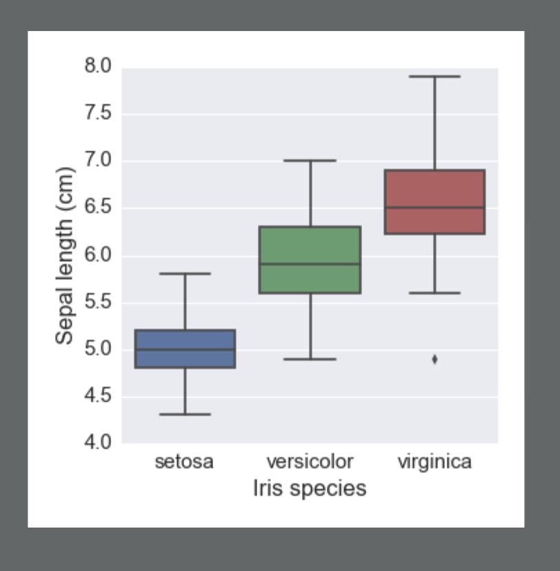

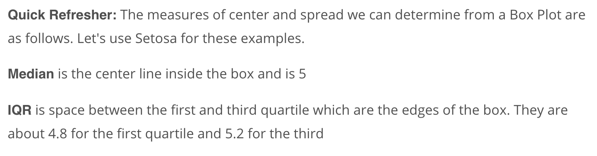

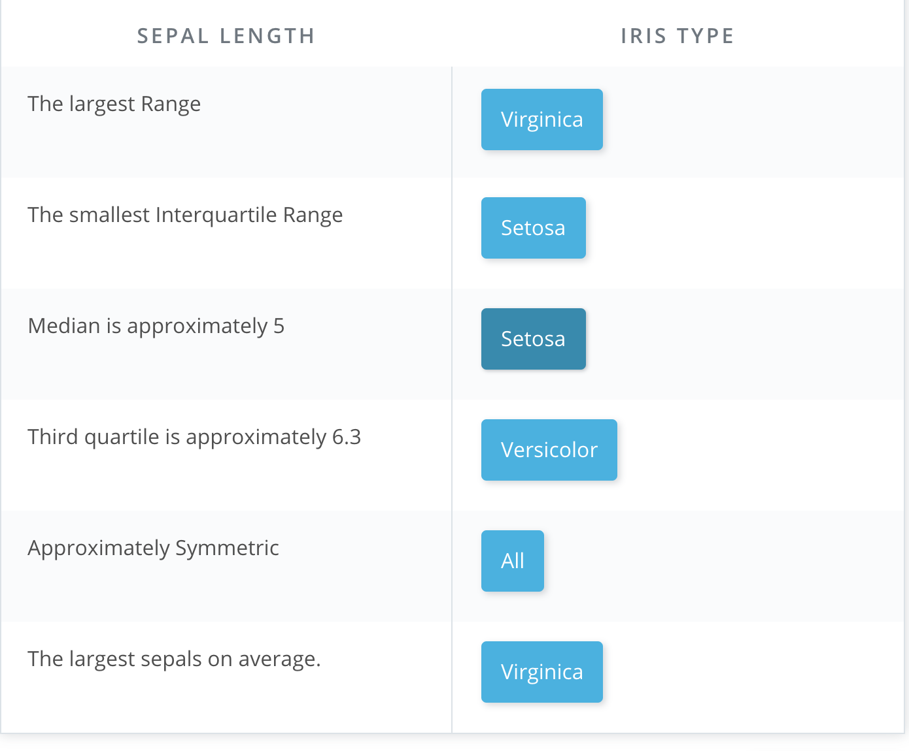

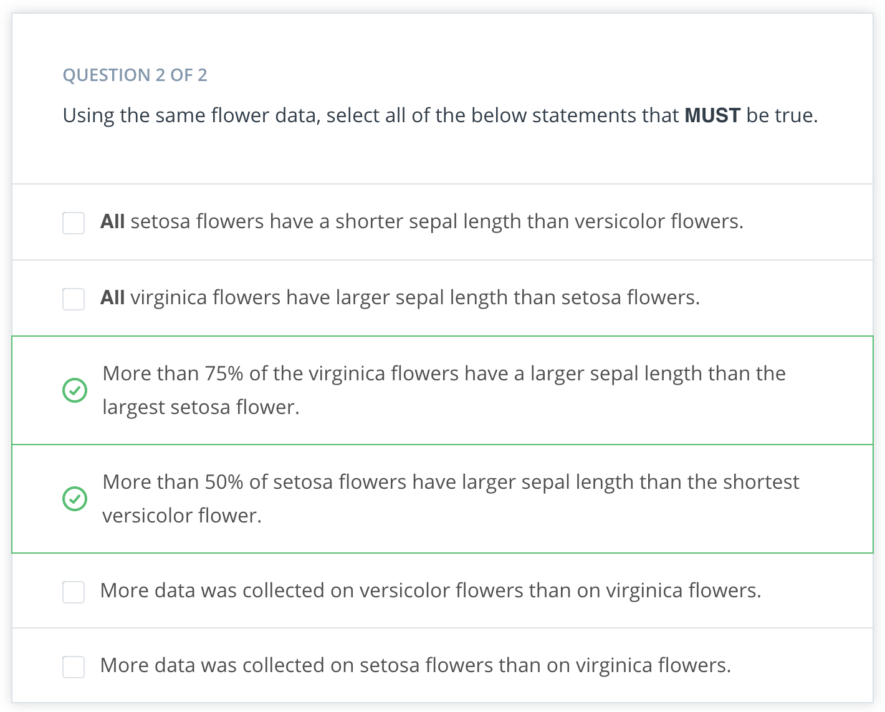

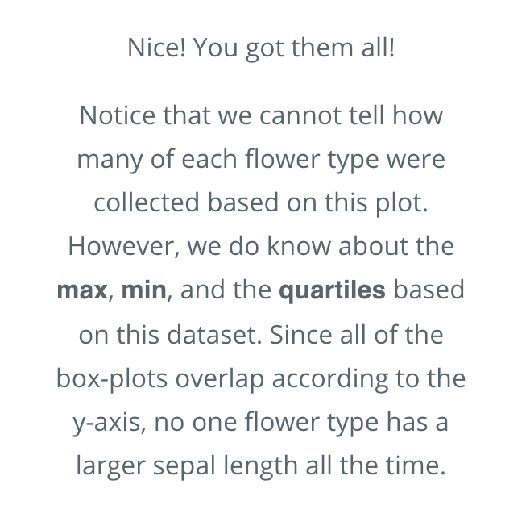

**Example of Bi-modal distribution**

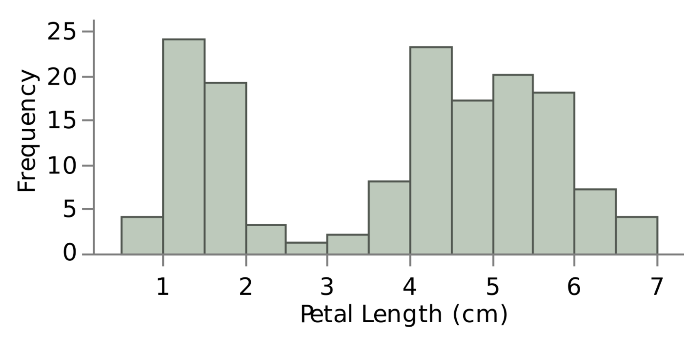

**Notice it has two areas where there are peaks in our dataset.**

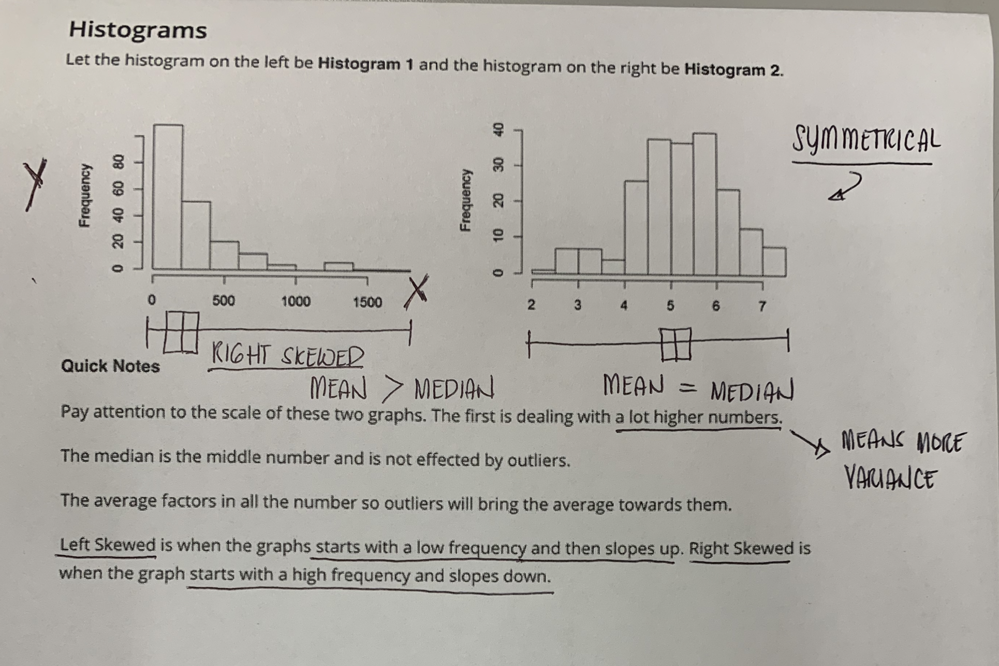

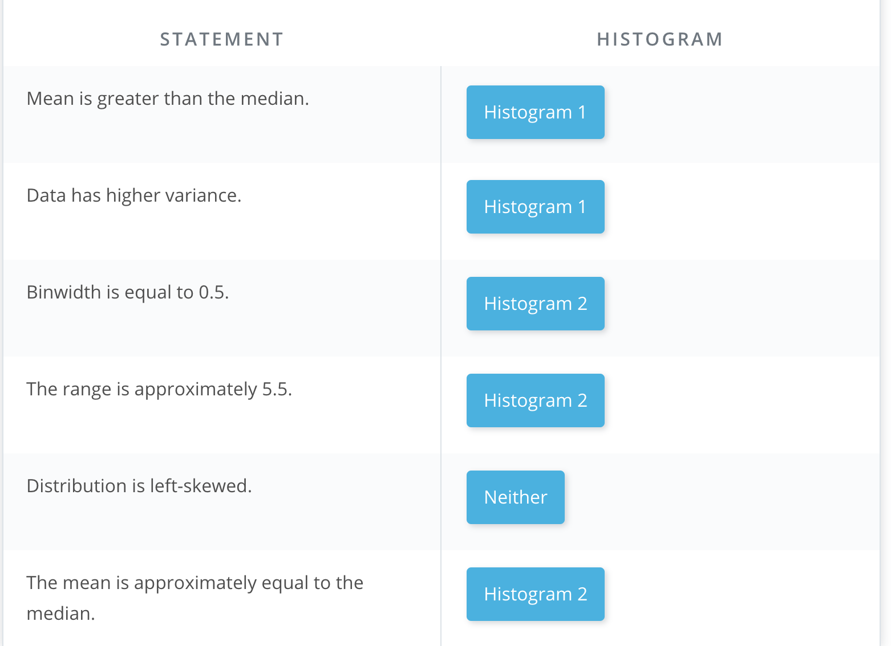

### What Measures of Spread & Center Should We Use?

**More On Center And Spread**

> When analyzing skewed data, it is common to report numeric summaries like the median and 5 number summary, as the mean and standard deviation may be misleading.

> However, with symmetric data, the mean and standard deviation are commonly used, as we can understand what proportion of points might fall 1, 2, or 3 standard deviations away based on the empirical rule associated with normal distributions.

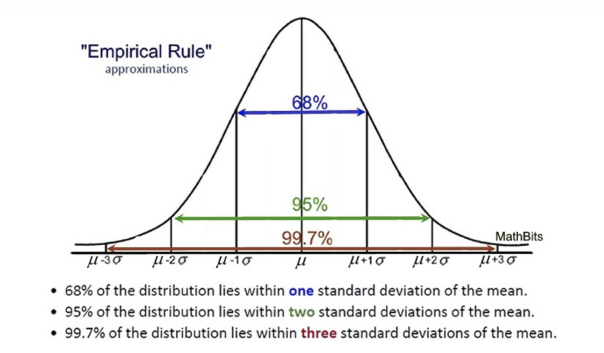

You can read more about this [here](https://www.mathsisfun.com/data/standard-normal-distribution.html).

**Standard Deviation and Skewed Distributions**

Standard Deviations can be calculated for any data set, whether it is normally distributed or skewed.

Also the **standard deviation basically provides which of two sets of data are more spread out**.

## Recap

**Variable Types**

We have covered a lot up to this point! We started with identifying data types as either `categorical` or `quantitative`. We then learned, we could identify quantitative variables as either `continuous` or `discrete`. We also found we could identify categorical variables as either `ordinal` or `nominal`.

**Categorical Variables**

When analyzing categorical variables, we commonly just look at the count or percent of a group that falls into each level of a category. For example, if we had two levels of a dog category: lab and not lab. We might say, 32% of the dogs were lab (percent), or we might say 32 of the 100 dogs I saw were labs (count).

However, the 4 aspects associated with `describing quantitative variables` are not used to describe categorical variables.

**Quantitative Variables**

Then we learned there are four main aspects used to describe `quantitative` variables:

1. Measures of Center
2. Measures of Spread
3. Shape of the Distribution
4. Outliers

**Measures of Center**

We looked at calculating measures of Center

1. Means
2. Medians
3. Modes

**Measures of Spread**

We also looked at calculating measures of Spread

1. Range
2. Interquartile Range
3. Standard Deviation
4. Variance

**Shape**

We learned that the distribution of our data is frequently associated with one of the three shapes:

1. Right-skewed

2. Left-skewed

3. Symmetric (frequently normally distributed)

Depending on the shape associated with our dataset, certain measures of center or spread may be better for summarizing our dataset.

When we have data that follows a **normal distribution**, we can completely understand our dataset using the **mean and standard deviation**.

However, if our dataset is **skewed**, the **5 number summary (and measures of center associated with it)** might be better to summarize our dataset.

**Outliers**

We learned that outliers have a larger influence on measures like the mean than on measures like the median. We learned that we should work with outliers on a situation by situation basis. Common techniques include:

1. At least note they exist and the impact on summary statistics.

2. If typo - remove or fix

3. Understand why they exist, and the impact on questions we are trying to answer about our data.

4. Reporting the 5 number summary values is often a better indication than measures like the mean and standard deviation when we have outliers.

5. Be careful in reporting. Know how to ask the right questions.

**Histograms and Box Plots**

We also looked at histograms and box plots to visualize our quantitative data. Identifying outliers and the shape associated with the distribution of our data are easier when using a visual as opposed to using summary statistics.

**What Next?**
Up to this point, we have only looked at **Descriptive Statistics**, because we are describing our collected data. In the final sections of this lesson, we will be looking at the difference between **Descriptive Statistics** and **Inferential Statistics**.

### [Descriptive vs. Inferential Statistics](https://www.youtube.com/watch?v=XV9pd8-RZ78)  :tv:

In this section, we learned about how Inferential Statistics differs from Descriptive Statistics.

**Descriptive Statistics**

**Descriptive statistics** is about describing our collected data.

**Inferential Statistics**

**Inferential Statistics** is about using our collected data to draw conclusions to a larger population.

We looked at specific examples that allowed us to identify the

1. Population - our entire group of interest.
2. Parameter - numeric summary about a population
3. Sample - subset of the population
4. Statistic numeric summary about a sample

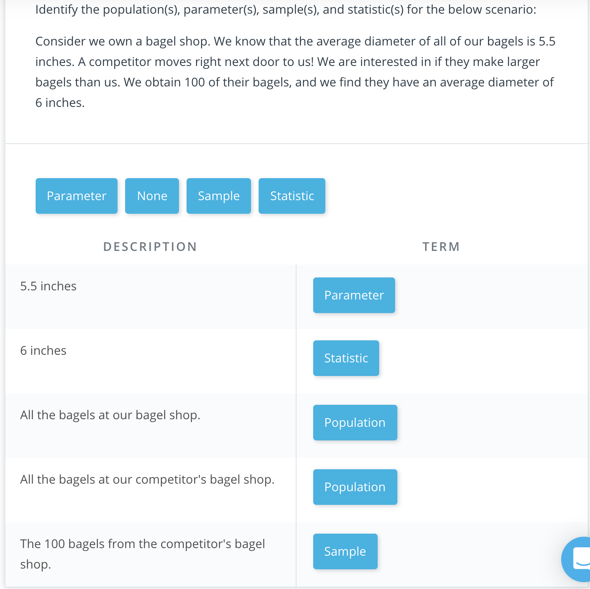

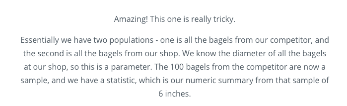

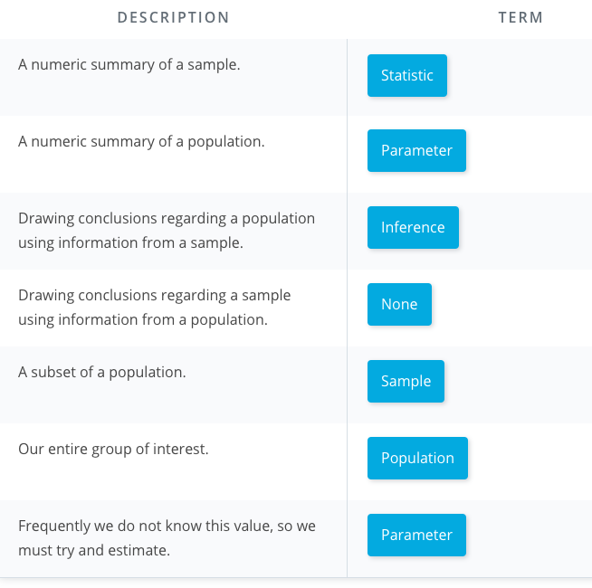

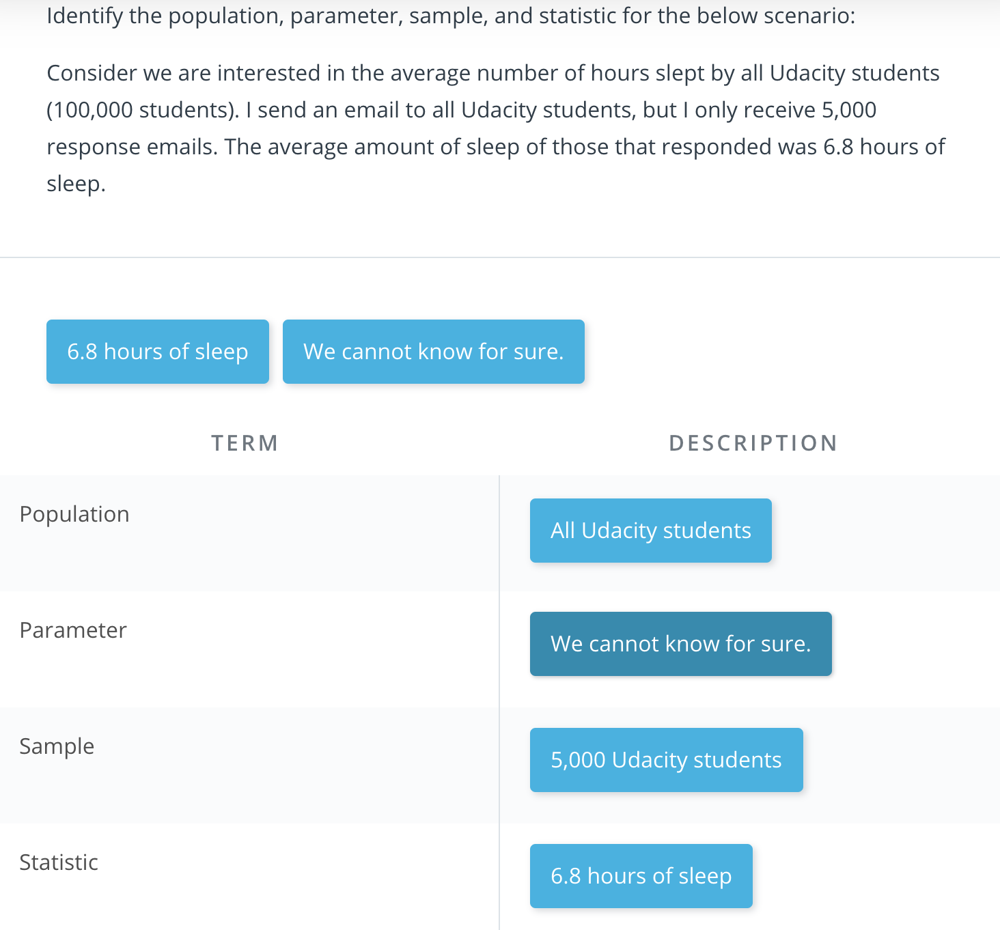

### [Recap](https://www.youtube.com/watch?v=Fe7Gta2SfLA) :tv:

**Descriptive vs. Inferential Statistics**

In this section, we learned about how Inferential Statistics differs from Descriptive Statistics.

**Descriptive Statistics**

Descriptive statistics is about describing our collected data using the measures discussed throughout this lesson: measures of center, measures of spread, shape of our distribution, and outliers. We can also use plots of our data to gain a better understanding.

**Inferential Statistics**

Inferential Statistics is about using our collected data to draw conclusions to a larger population. Performing inferential statistics well requires that we take a sample that accurately represents our population of interest.

A common way to collect data is via a survey. However, surveys may be extremely biased depending on the types of questions that are asked, and the way the questions are asked. This is a topic you should think about when tackling the first project.

We looked at specific examples that allowed us to identify the

1. Population - our entire group of interest.
2. Parameter - numeric summary about a population
3. Sample - subset of the population
4. Statistic - numeric summary about a sample

**Looking Ahead**
Though we will not be diving deep into inferential statistics within this course, you are now aware of the difference between these two branches of statistics. If you have ever conducted a hypothesis test or built a confidence interval, you have performed inferential statistics. The way we perform inferential statistics is changing as technology evolves. Many career paths involving `Machine Learning` and `Artificial Intelligence` are aimed at using collected data to draw conclusions about entire populations at an individual level.